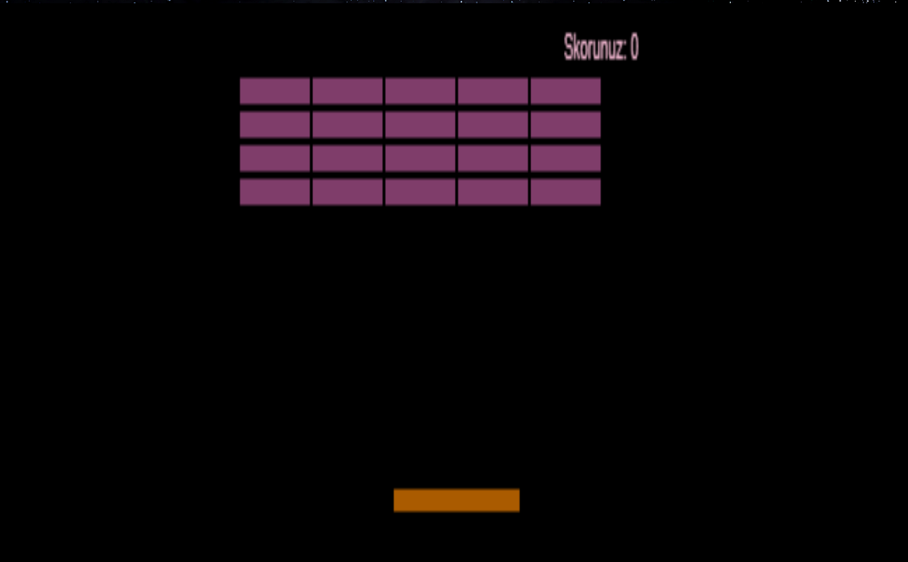
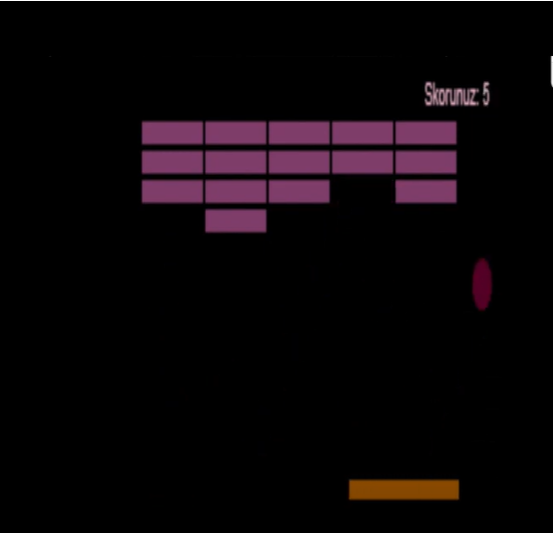

# Blok Kırma Oyunu (Breakout)

## Oyun Açıklaması

Blok Kırma Oyunu (veya Breakout), basit ama eğlenceli bir oyun deneyimi sunar. Oyun başladığında ekranınızda bir top, alt tarafta topu yönlendirecek bir blok ve üst taraflarda kırılmayı bekleyen bloklar bulunur.

- Oyun başladığında top, ilk hareketini yukarı yönlü olarak yapar. 
- Top, çarptığı nesnelere bağlı olarak hareketini değiştirir.
- Bir blok kırıldığında, skora 1 puan eklenir. Top, blokları kırdıkça, skorunuz blok sayısıyla orantılı olarak artar.
- Eğer top, alt taraftaki blok dışında bir yere düşerse, skor sıfırlanır ve oyun güncellenir.

## Kullanılan Teknolojiler

- **HTML**: Sayfanın yapısı için kullanılmıştır.
- **CSS**: Oyunun görsel tasarımını yapmak için kullanılmıştır.
- **JavaScript**: Oyunun işlevselliğini sağlamak ve etkileşimi yönetmek için kullanılmıştır.

## Oyun Görselleri

Oyunun nasıl göründüğünü görmek için aşağıdaki görsellere göz atabilirsiniz:

| Oyun Görüntüsü 1 | Oyun Görüntüsü 2 |
| ---------------- | ---------------- |
|  |  |

Ayrıca, oyunun tanıtım videosuna aşağıdaki bağlantıdan erişebilirsiniz:

- [Oyun Videosu](https://youtu.be/hcAn_5_r_Qk?feature=shared)

## Oyun Erişimi

Bu bağlantıdan oyunu oynayabilirsiniz:

- [Breakout Oyunu Oyna](https://esra-ilboga.github.io/breakout-game/)

Keyifli oyunlar!
